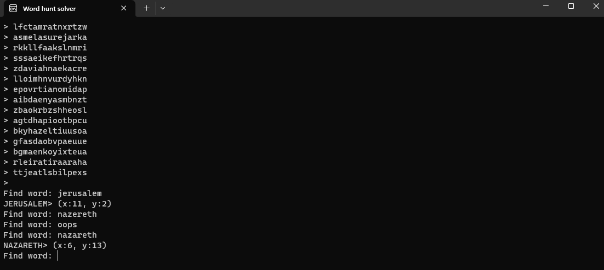
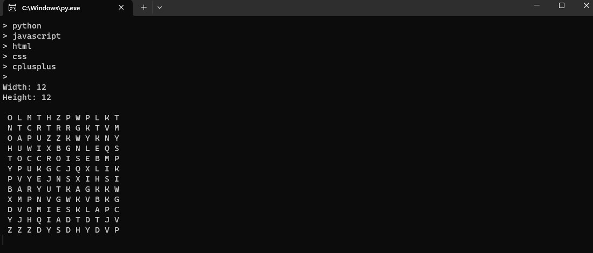

# WordHunts

A solver and generator for word hunt puzzles

## hunter.py

Run this file to solve word hunts.

When you see the "> " prompt, enter a line from the

word hunt and click Enter. Once you have entered each

line, press Enter again. It will now prompt you with

"Find word: ". Enter a word to find and it will show

you the position of the first letter. (You can take it

from there)

Sometimes it will not tell you where a word is until

you spell the word backwards. I don't know why.

## maker.py

Run this file to create word hunts.

When you see the "> " prompt, enter a word you want

in your word hunt. Once you have entered all your 

words, click Enter again. After giving it the width

and height of the puzzle, it will give you a full

word hunt.

